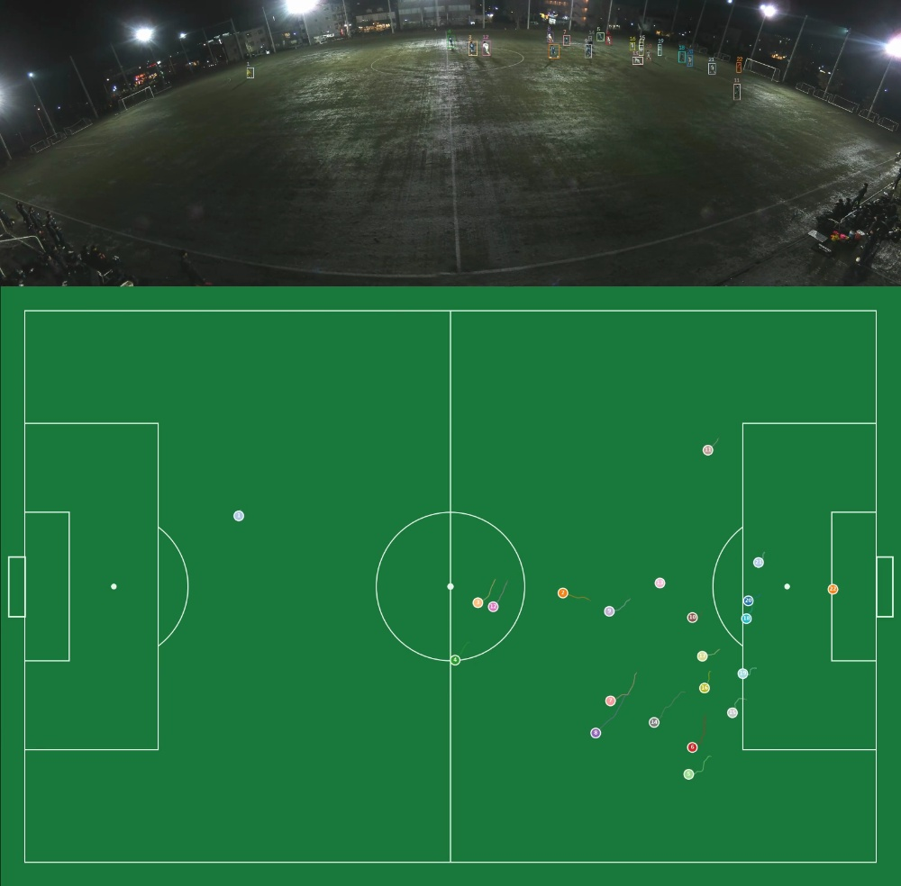

# Footlytics — video demos

## Ground-truth showcase

| Demo | Duration | Download |
| --- | --- | --- |
| GT video with player boxes + smoothed radar | 40 seconds | [MP4](https://github.com/scalliontor/Footlytics/raw/refs/heads/main/docs/demos/gt-video-radar-40s.mp4) |
| GT tactical radar | 4 minutes | [MP4](https://github.com/scalliontor/Footlytics/raw/refs/heads/main/docs/demos/gt-radar-4min.mp4) |
| Our pipeline, confidence 0.25 / pitch margin 2 m | 10 seconds | [MP4](https://github.com/scalliontor/Footlytics/raw/refs/heads/main/docs/demos/pipeline-detection-10s.mp4) |
| Our pipeline, confidence 0.10 / pitch margin 6 m | 10 seconds | [MP4](https://github.com/scalliontor/Footlytics/raw/refs/heads/main/docs/demos/pipeline-detection-low-confidence-10s.mp4) |

The first two videos use supplied annotations, not automated predictions.
The other two use our detector/tracker and contain missed players, false positives
and fragmented identities. Confidence and pitch margin both change between those
runs, so this is not a controlled confidence-only comparison.

These are existing prototype exports from match 117092. GT feet are mapped using
the dataset calibration; radar positions are filtered for display. The legacy
render uses a 105 × 76 m pitch assumption that has not been independently verified.
The current dataset card specifies 105 × 68 m. These clips demonstrate the viewer,
not verified metric calibration, player speed, formation, or identity accuracy.
Exact file dimensions and durations are recorded in [manifest.json](manifest.json).

## Caption để đăng page

> Footlytics đang phát triển công cụ xem lại và phân tích bóng đá cho các đội bóng Việt Nam. ⚽
>
> Demo này đặt video trận đấu cạnh bản đồ vị trí cầu thủ 2D, giúp hình dung cách xem lại chuyển động và tổ chức đội hình theo thời gian.
>
> Video minh hoạ sử dụng dữ liệu gán nhãn có sẵn (ground truth) từ SoccerTrack v2. Hệ thống tự nhận diện và theo dõi cầu thủ của Footlytics đang được phát triển; độ ổn định và hiệu chuẩn sân vẫn cần cải thiện.
>
> Nguồn: SoccerTrack v2 / AtomScott — CC BY 4.0. Footlytics bổ sung lớp hiển thị bounding box, lọc vị trí để hiển thị và radar 2D.
>
> #Footlytics #FootballAnalytics #BongDaVietNam #SportsTech

Upload `gt-video-radar-40s.mp4` directly to your social page for native video playback.

## Source and attribution

Footage and annotations: **SoccerTrack v2**, released by **AtomScott and the
SoccerTrack v2 contributors**, match **117092**.

- [Dataset and attribution information](https://huggingface.co/datasets/atomscott/soccertrack-v2)
- [Dataset code and documentation](https://github.com/AtomScott/SoccerTrack-v2)
- [Creative Commons Attribution 4.0 license](https://creativecommons.org/licenses/by/4.0/)

Modifications by Footlytics: excerpts/re-encoding, player-box overlays, coordinate
mapping, display smoothing, tactical radar rendering and combined video layout.
These demo assets retain their source CC BY 4.0 terms. No endorsement by the
dataset authors or camera provider is implied.
